<h1 align="center"> Schedule Assistant App 🗓️🤖

<p align="center">
  
  
  
  
</p>

## 🎯 Overview

Schedule Assistant App adalah aplikasi mobile berbasis Flutter dengan backend Flask yang mengintegrasikan **Gemini AI** untuk manajemen jadwal cerdas. Aplikasi ini menyediakan asisten AI yang dapat membantu pengguna dalam mengatur, mengelola, dan mengoptimalkan jadwal harian mereka dengan antarmuka yang intuitif dan responsif.

## ✨ Fitur Utama

### 📱 Mobile Interface
- **Smart Schedule Management** - Buat, lihat, dan kelola jadwal harian dengan mudah
- **AI-Powered Chat Interface** - Interaksi natural language dengan asisten Gemini AI
- **Today's Quick View** - Akses cepat ke jadwal hari ini dengan nama hari Indonesia
- **Batch Operations** - Tambah multiple jadwal sekaligus untuk efisiensi
- **Secure Authentication** - Sistem registrasi dan login yang aman
- **Responsive Design** - Optimal di semua perangkat mobile

### 🤖 AI Features
- **Gemini AI Integration** - Multiple model fallback system untuk reliability
- **Intelligent Scheduling** - AI membantu optimasi dan saran jadwal
- **Natural Language Processing** - Chat dengan AI menggunakan bahasa natural
- **Localized Responses** - Respons AI dalam bahasa Indonesia
- **Context-Aware Assistance** - AI memahami konteks jadwal pengguna

### 🛡️ Backend Features
- **Flask REST API** - Backend service dengan endpoint terstruktur
- **Comprehensive Error Handling** - Graceful degradation saat AI tidak tersedia
- **Health Monitoring** - System status checks untuk semua komponen
- **Database Flexibility** - Support SQLite dan MySQL
- **CORS Support** - Cross-origin resource sharing untuk web integration

## 📋 Requirements

### Mobile Development
- Flutter SDK (>=3.0.0)
- Dart SDK (>=3.0.0)
- Android Studio / VS Code
- Android device atau emulator

### Backend Development
- Python 3.8+
- Google Gemini API key
- Flask framework
- Virtual environment (recommended)

### Dependencies

```yaml
# Flutter dependencies
dependencies:
  flutter:
    sdk: flutter
  http: ^1.1.0
  cupertino_icons: ^1.0.2
  shared_preferences: ^2.2.0

# Python dependencies
Flask==2.3.3
Flask-CORS==4.0.0
google-generativeai==0.3.0
python-dotenv==1.0.0
```

## 🚀 Installation

### 1. Clone Repository
```bash
git clone https://github.com/ficrammanifur/flutter-project/tree/main/Asistant%20Penjadwalan.git
cd schedule-assistant-app
```

### 2. Backend Setup

#### Install Python Dependencies
```bash
# Create virtual environment
python -m venv venv

# Activate virtual environment
# Windows:
venv\\Scripts\\activate
# macOS/Linux:
source venv/bin/activate

# Install dependencies
cd backend
pip install -r requirements.txt
```

#### Configure Environment
Create a `.env` file in backend directory:
```env
GEMINI_API_KEY=your_gemini_api_key_here
FLASK_DEBUG=True
DATABASE_URL=sqlite:///schedule.db
```

#### Run Flask Server
```bash
python app.py
```
Server akan berjalan di `http://localhost:5000`

### 3. Mobile App Setup

#### Install Flutter Dependencies
```bash
# Get Flutter packages
flutter pub get

# Run code generation (if needed)
flutter packages pub run build_runner build
```

#### Configure API Base URL
Update `lib/constants.dart`:
```dart
// For emulator
const String baseUrl = 'http://10.0.2.2:5000';
// For physical device
const String baseUrl = 'http://your-local-ip:5000';
```

#### Run Flutter App
```bash
# Run on connected device/emulator
flutter run

# Run in debug mode
flutter run --debug

# Build APK
flutter build apk --release
```

## 📈 Use Case Diagram

Berikut adalah diagram use case yang menggambarkan interaksi antara pengguna dan sistem Schedule Assistant App.

```mermaid title="Use Case Diagram: Schedule Assistant App" type="diagram"
%% Use Case Diagram for Schedule Assistant App
graph TD
    actor "Pengguna" as User

    rectangle "Schedule Assistant App" {
        User  (Registrasi Akun)
        User  (Login ke Akun)
        User  (Kelola Jadwal)
        User  (Lihat Jadwal Hari Ini)
        User  (Chat dengan Asisten AI)

        (Kelola Jadwal) <--- (Tambah Jadwal)
        (Kelola Jadwal) <--- (Lihat Semua Jadwal)
        (Kelola Jadwal) <--- (Hapus Jadwal)
        (Kelola Jadwal) <--- (Tambah Jadwal Batch)

        (Chat dengan Asisten AI) ..> (Dapatkan Saran Optimasi Jadwal) : <<extends>>
        (Chat dengan Asisten AI) ..> (Dapatkan Penjelasan Jadwal) : <<extends>>
    }
```

## 📡 API Endpoints Structure

### 🔄 GET/POST REST API Flow Diagram - Schedule Assistant

```mermaid
graph TD
    A[📱 Flutter App] --> B[🔄 API Service Call]
    B --> C[📡 HTTP Request]
    C --> D[🌐 Network Layer]
    D --> E[🔍 Check Network Connection]
    
    E -->|✅ Connected| F[📤 Send Request to Server]
    E -->|❌ No Connection| G[⚠️ Network Error]
    
    F --> H[🖥️ Flask Backend Server]
    H --> I[🛡️ Request Validation]
    
    I -->|✅ Valid| J[📊 Process Request]
    I -->|❌ Invalid| K[🚫 400 Bad Request]
    
    J --> L[🤖 Gemini AI Processing]
    L --> M[💾 Database Operations]
    M --> N[📦 JSON Response]
    
    N --> O[📡 HTTP Response]
    O --> P[📱 Flutter Receives Response]
    
    P --> Q[🔍 Status Code Check]
    
    Q -->|200 OK| R[✅ Parse JSON Data]
    Q -->|4xx/5xx Error| S[❌ Handle Error]
    
    R --> T[🔄 Update UI State]
    T --> U[📱 Display Data to User]
    
    S --> V[📱 Show Error Message]
    G --> V
    K --> V
    
    V --> W[🔄 Retry Option]
    W --> B
    
    style A fill:#e1f5fe
    style H fill:#f3e5f5
    style L fill:#fff3e0
    style U fill:#e8f5e8
    style V fill:#ffebee
```



## Detailed API Flow Steps:

### 1. **Client Side (Flutter App)**
```dart
// 1. User Action Triggers API Call
Future<Map<String, dynamic>> getChatResponse(String message) async {
  try {
    // 2. Create HTTP POST Request
    final response = await http.post(
      Uri.parse('\$baseUrl/api/chat'),
      headers: {'Content-Type': 'application/json'},
      body: json.encode({
        'message': message,
        'user_id': userId,
      }),
    );
    
    // 3. Check Response Status
    if (response.statusCode == 200) {
      // 4. Parse JSON Response
      return json.decode(response.body);
    }
    throw Exception('Failed to get AI response');
  } catch (e) {
    // 5. Handle Errors
    return {'error': 'AI service unavailable'};
  }
}
```

### 2. **Server Side (Flask Backend)**
```python
@app.route('/api/chat', methods=['POST'])
def chat_with_ai():
    try:
        # 1. Validate Request
        data = request.get_json()
        message = data.get('message')
        user_id = data.get('user_id')
        
        # 2. Process with Gemini AI
        ai_response = gemini_service.generate_response(message, user_id)
        
        # 3. Format Response
        return jsonify({
            "success": True,
            "response": ai_response,
            "timestamp": datetime.now().isoformat()
        })
    except Exception as e:
        # 4. Handle Server Errors
        return jsonify({
            "success": False,
            "error": str(e)
        }), 500
```

## Specific API Endpoints Flow:

### Schedule Assistant API Endpoints Flow

```mermaid
graph LR
    A[📱 Flutter App] --> B[🎯 API Endpoints]
    
    B --> C[🔐 POST /signup]
    B --> D[🔑 POST /signin]
    B --> E[📅 POST /jadwal]
    B --> F[📋 GET /jadwal/user_id]
    B --> G[📆 GET /jadwal/hari-ini/user_id]
    B --> H[🤖 POST /api/chat]
    B --> I[🏥 GET /health]
    
    C --> J[👤 User Registration]
    D --> K[🔓 User Authentication]
    E --> L[➕ Add Schedule]
    F --> M[📊 All Schedules]
    G --> N[📅 Today Schedule]
    H --> O[🤖 AI Chat Response]
    I --> P[💚 System Status]
    
    J --> Q[📱 Auth Screen]
    K --> R[📱 Home Screen]
    L --> S[📱 Schedule Screen]
    M --> T[📱 Schedule List]
    N --> U[📱 Today View]
    O --> V[📱 Chat Interface]
    P --> W[📱 Status Indicator]
    
    style C fill:#e3f2fd
    style H fill:#f3e5f5
    style E fill:#e8f5e8
    style I fill:#fff3e0
```


## HTTP Status Codes Flow:

### HTTP Status Code Handling

```mermaid
graph TD
    A[📡 HTTP Response] --> B[🔍 Status Code Check]
    
    B --> C[✅ 200 OK]
    B --> D[❌ 400 Bad Request]
    B --> E[🔒 401 Unauthorized]
    B --> F[🚫 404 Not Found]
    B --> G[💥 500 Server Error]
    
    C --> H[📊 Process Data]
    D --> I[⚠️ Validation Error]
    E --> J[🔐 Authentication Required]
    F --> K[❓ Endpoint Not Found]
    G --> L[🛠️ Server Issue]
    
    H --> M[📱 Update UI]
    I --> N[📝 Show Form Errors]
    J --> O[🔑 Redirect to Login]
    K --> P[🔄 Check URL]
    L --> Q[🔄 Retry Later]
    
    style C fill:#c8e6c9
    style D fill:#ffcdd2
    style E fill:#ffe0b2
    style F fill:#f8bbd9
    style G fill:#ffcdd2
```


## Error Handling Flow:

### API Error Handling Strategy

```mermaid
graph TD
    A[🚨 Error Occurred] --> B[🔍 Error Type Check]
    
    B --> C[🌐 Network Error]
    B --> D[📡 HTTP Error]
    B --> E[🤖 AI Service Error]
    B --> F[⏱️ Timeout Error]
    
    C --> G[📱 Show Offline Mode]
    D --> H[📝 Show Error Message]
    E --> I[🔄 Fallback Response]
    F --> J[🔄 Retry Request]
    
    G --> K[💾 Use Cached Data]
    H --> L[🔄 Retry Option]
    I --> M[📱 Continue with Basic Features]
    J --> N[⏳ Show Loading]
    
    style A fill:#ffcdd2
    style G fill:#fff3e0
    style I fill:#e8f5e8
```


---

## Implementation Example:

```dart
class ApiService {
  static Future<Map<String, dynamic>> getTodaySchedule(String userId) async {
    try {
      // 1. Network Check
      final response = await http.get(
        Uri.parse('\$baseUrl/jadwal/hari-ini/\$userId'),
        headers: {'Content-Type': 'application/json'},
      ).timeout(Duration(seconds: 30));
      
      // 2. Status Code Handling
      switch (response.statusCode) {
        case 200:
          return json.decode(response.body);
        case 400:
          throw BadRequestException('Invalid request');
        case 401:
          throw UnauthorizedException('Authentication required');
        case 404:
          throw NotFoundException('User not found');
        case 500:
          throw ServerException('Server error');
        default:
          throw Exception('Unknown error: \${response.statusCode}');
      }
    } on SocketException {
      // 3. Network Error
      return _getCachedSchedule(userId);
    } on TimeoutException {
      // 4. Timeout Error
      throw TimeoutException('Request timeout');
    } catch (e) {
      // 5. General Error
      throw Exception('Failed to load schedule: \$e');
    }
  }
}
```

## 📂 Project Structure

```
schedule-assistant-app/
├── backend/
│   ├── scripts/
│   │   ├── create_database.sql
│   │   └── seed_data.sql   
│   ├── .env                  # Gemini API, Database Configuration, Flask Configuration
│   ├── app.py                # Main Flask application
│   ├── db_config.py          # Database configuration and utilities
│   └── requirements.txt      # Python dependencies
└── frontend/
│   lib/
│   ├── main.dart              # App entry point
│   ├── constants.dart         # App constants
│   ├── pages/                 # UI screens
│   │   ├── splash_screen.dart
│   │   ├── home_page.dart
│   │   ├── auth/              # Authentication flows
│   │   │   ├── signin_page.dart
│   │   │   ├── signup_page.dart
│   │   │   └── forgot_password_page.dart
│   │   ├── chat/              # AI chat interface
│   │   │   └── chat_page.dart
│   │   └── jadwal/            # Schedule management
│   │       ├── input_jadwal_page.dart
│   │       ├── jadwal_hari_ini_page.dart
│   │       └── lihat_jadwal_page.dart
│   ├── services/              # API services
│   │   ├── auth_service.dart
│   │   ├── chat_service.dart
│   │   └── jadwal_service.dart
│   ├── models/                # Data models
│   │   ├── user_model.dart
│   │   └── schedule_model.dart
│   ├── utils/                 # Utilities
│   │   ├── date_utils.dart
│   │   └── validators.dart
│   └── widgets/               # Reusable components
│       ├── feature_card.dart
│       └── custom_button.dart
├── assets/                    # App assets
│   ├── images/
│   └── icons/
├── pubspec.yaml              # Flutter dependencies
└── README.md                 # This file
```

## 🎯 API Endpoints

### 🔐 Authentication
- `POST /signup` - User registration
  - Body: `{name, email, password}`
  - Response: `{success, message, user_id}`
- `POST /signin` - User login
  - Body: `{email, password}`
  - Response: `{success, message, user_id, token}`

### 📆 Schedule Management
- `POST /jadwal` - Add new schedule
  - Body: `{user_id, tanggal, waktu, kegiatan, deskripsi}`
  - Response: `{success, message, jadwal_id}`
- `GET /jadwal/<user_id>` - Get all schedules
  - Response: `{success, data: [schedules]}`
- `GET /jadwal/hari-ini/<user_id>` - Get today's schedule
  - Response: `{success, data: [today_schedules], hari}`
- `DELETE /jadwal/<jadwal_id>` - Delete schedule
  - Response: `{success, message}`
- `POST /jadwal-batch` - Add multiple schedules
  - Body: `{user_id, schedules: [...]}`
  - Response: `{success, message, created_count}`

### 🤖 AI Features
- `POST /api/chat` - Chat with AI assistant
  - Body: `{message, user_id}`
  - Response: `{success, response, timestamp}`
- `GET /api/list-models` - List available AI models
  - Response: `{success, models: [...]}`

### 🧪 Utility
- `GET /health` - System health check
  - Response: `{status, ai_status, db_status, timestamp}`

## 🔧 Configuration

### Backend Configuration
1. **Environment Variables** (`.env`):
   ```env
   GEMINI_API_KEY=your_gemini_api_key
   FLASK_DEBUG=True
   DATABASE_URL=sqlite:///schedule.db
   SECRET_KEY=your_secret_key
   ```

2. **Database Setup**:
   ```python
   # db_config.py
   import sqlite3
   
   def init_db():
       conn = sqlite3.connect('schedule.db')
       # Create tables
       conn.execute('''CREATE TABLE IF NOT EXISTS users...''')
       conn.execute('''CREATE TABLE IF NOT EXISTS schedules...''')
       conn.commit()
       conn.close()
   ```

### Frontend Configuration
1. **API Base URL** (`lib/constants.dart`):
   ```dart
   class ApiConstants {
     // For Android Emulator
     static const String baseUrl = 'http://10.0.2.2:5000';
     
     // For iOS Simulator
     // static const String baseUrl = 'http://localhost:5000';
     
     // For Physical Device
     // static const String baseUrl = 'http://192.168.1.100:5000';
   }
   ```

2. **Theme Configuration** (optional):
   ```dart
   // lib/theme/app_theme.dart
   class AppTheme {
     static ThemeData lightTheme = ThemeData(
       primarySwatch: Colors.blue,
       visualDensity: VisualDensity.adaptivePlatformDensity,
     );
   }
   ```

## 🌐 Deployment

### Backend Deployment
```bash
# Using Gunicorn
pip install gunicorn
gunicorn -w 4 -b 0.0.0.0:5000 app:app

# Using Docker
docker build -t schedule-assistant-backend .
docker run -p 5000:5000 schedule-assistant-backend
```

### Frontend Deployment
```bash
# Build APK for Android
flutter build apk --release

# Build App Bundle for Google Play
flutter build appbundle --release

# Build for iOS (macOS only)
flutter build ios --release
```

## 🧪 Testing

### Backend Testing
```bash
# Install testing dependencies
pip install pytest pytest-flask

# Run tests
pytest tests/
```

### Frontend Testing
```bash
# Run unit tests
flutter test

# Run integration tests
flutter test integration_test/
```

## 🤝 Contributing

1. **Fork** the repository
2. **Create** your feature branch (`git checkout -b feature/AmazingFeature`)
3. **Commit** your changes (`git commit -m 'Add some AmazingFeature'`)
4. **Push** to the branch (`git push origin feature/AmazingFeature`)
5. **Open** a Pull Request

### Development Guidelines
- Follow Flutter/Dart style guide
- Write comprehensive tests
- Update documentation
- Use meaningful commit messages

## 📝 License

This project is licensed under the **MIT License** - see the [LICENSE](./LICENSE) file for details.

## 👤 Authors

- **Ficrammanifur** - *Student* - [YourGitHub](https://github.com/ficrammanifur)

## 🙏 Acknowledgments

- **Google** for providing Gemini AI API
- **Flutter & Dart communities** for excellent documentation
- **Flask community** for the robust web framework
- **Academic advisors** for guidance and support
- **Open source contributors** who made this project possible

---

<div align="center">
  **Made with ❤️ for intelligent schedule management**
  
<p><a href="#top">⬆ Back on Top</a></p>

</div>
