# ARIMA Analytics Mobile App

<p align="center">
  
  
  
  
</p>

## 🎯 Overview

Aplikasi mobile ARIMA Analytics adalah sistem prediksi bahan baku berbasis machine learning yang menggunakan model ARIMA (AutoRegressive Integrated Moving Average). Aplikasi ini menyediakan dashboard real-time untuk monitoring stok, prediksi kebutuhan bahan baku, dan manajemen inventory dengan antarmuka yang modern dan responsif.

## ✨ Fitur Utama

### 📱 Mobile Interface
- **Real-time Dashboard** - Monitoring statistik penjualan dan stok secara real-time
- **Modern UI** - Desain glassmorphism dengan animasi smooth dan responsive
- **ARIMA Prediction** - Konfigurasi dan eksekusi model prediksi dengan parameter custom
- **Materials Management** - Monitoring stok bahan baku dengan alert system
- **Interactive Charts** - Visualisasi data historis dan hasil prediksi
- **Quick Actions** - Akses cepat ke fitur utama aplikasi

### 🤖 Backend Features
- **Flask REST API** - Backend service dengan endpoint terstruktur
- **ARIMA Model** - Implementasi model prediksi time series
- **Data Processing** - Utilities untuk cleaning dan preprocessing data
- **Mock Data Support** - Fallback data untuk development dan testing
- **Error Handling** - Comprehensive error handling dan logging
- **CORS Support** - Cross-origin resource sharing untuk web integration

## 📋 Requirements

### Mobile Development
- Flutter SDK (>=3.0.0)
- Dart SDK
- Android Studio / VS Code
- Android device atau emulator

### Backend Development
- Python 3.8+
- Flask framework
- NumPy, Pandas untuk data processing
- Virtual environment (recommended)

### Dependencies
\`\`\`yaml
# Flutter dependencies
dependencies:
  flutter:
    sdk: flutter
  http: ^1.1.0
  cupertino_icons: ^1.0.2

# Python dependencies
Flask==2.3.3
Flask-CORS==4.0.0
pandas==2.0.3
numpy==1.24.3
scikit-learn==1.3.0
\`\`\`

## 🚀 Installation

### 1. Backend Setup

#### Install Python Dependencies
\`\`\`bash
# Create virtual environment
python -m venv venv

# Activate virtual environment
# Windows:
venv\Scripts\activate
# macOS/Linux:
source venv/bin/activate

# Install dependencies
pip install -r backend/requirements.txt
\`\`\`

#### Run Flask Server
\`\`\`bash
cd backend
python app.py
\`\`\`
Server akan berjalan di `http://localhost:5000`

### 2. Mobile App Setup

#### Install Flutter Dependencies
\`\`\`bash
# Get Flutter packages
flutter pub get

# Run code generation (if needed)
flutter packages pub run build_runner build
\`\`\`

#### Run Flutter App
\`\`\`bash
# Run on connected device/emulator
flutter run

# Run in debug mode
flutter run --debug

# Build APK
flutter build apk
\`\`\`

## 📡 API Endpoints Structure

### 🔄 GET REST API Flow Diagram - ARIMA Analytics

```mermaid
graph TD
    A["📱 Flutter App"] --> B["🔄 API Service Call"]
    B --> C["📡 HTTP GET Request"]
    C --> D["🌐 Network Layer"]
    D --> E["🔍 Check Network Connection"]
    
    E -->|"✅ Connected"| F["📤 Send Request to Server"]
    E -->|"❌ No Connection"| G["⚠️ Network Error"]
    
    F --> H["🖥️ Flask Backend Server"]
    H --> I["🛡️ Request Validation"]
    
    I -->|"✅ Valid"| J["📊 Process Request"]
    I -->|"❌ Invalid"| K["🚫 400 Bad Request"]
    
    J --> L["💾 Data Processing"]
    L --> M["📈 Generate Response Data"]
    M --> N["📦 JSON Response"]
    
    N --> O["📡 HTTP Response"]
    O --> P["📱 Flutter Receives Response"]
    
    P --> Q["🔍 Status Code Check"]
    
    Q -->|"200 OK"| R["✅ Parse JSON Data"]
    Q -->|"4xx/5xx Error"| S["❌ Handle Error"]
    
    R --> T["🔄 Update UI State"]
    T --> U["📱 Display Data to User"]
    
    S --> V["📱 Show Error Message"]
    G --> V
    K --> V
    
    V --> W["🔄 Retry Option"]
    W --> B
    
    style A fill:#e1f5fe
    style H fill:#f3e5f5
    style U fill:#e8f5e8
    style V fill:#ffebee
```



## Detailed API Flow Steps:

### 1. **Client Side (Flutter App)**
// 1. User Action Triggers API Call
Future<Map<String, dynamic>> getDashboardData() async {
  try {
    // 2. Create HTTP GET Request
    final response = await http.get(
      Uri.parse('$baseUrl/dashboard'),
      headers: {'Content-Type': 'application/json'},
    );
    
    // 3. Check Response Status
    if (response.statusCode == 200) {
      // 4. Parse JSON Response
      return json.decode(response.body);
    }
    throw Exception('Failed to load data');
  } catch (e) {
    // 5. Handle Errors
    return _getMockData();
  }
}

### 2. **Server Side (Flask Backend)**
```
@app.route('/api/dashboard', methods=['GET'])
def get_dashboard_data():
    try:
        # 1. Validate Request
        # 2. Process Business Logic
        # 3. Fetch/Calculate Data
        # 4. Format Response
        return jsonify({
            "success": True,
            "data": dashboard_stats
        })
    except Exception as e:
        # 5. Handle Server Errors
        return jsonify({
            "success": False,
            "error": str(e)
        }), 500
```
## Specific API Endpoints Flow:
### ARIMA Analytics API Endpoints Flow

```mermaid
graph LR
    A["📱 Flutter App"] --> B["🎯 API Endpoints"]
    
    B --> C["📊 GET /api/dashboard"]
    B --> D["🔮 POST /api/prediction"]
    B --> E["📦 GET /api/materials"]
    
    C --> F["📈 Dashboard Stats"]
    D --> G["🤖 ARIMA Results"]
    E --> H["📋 Stock Data"]
    
    F --> I["📱 Dashboard Screen"]
    G --> J["📱 Prediction Screen"]
    H --> K["📱 Materials Screen"]
    
    style C fill:#e3f2fd
    style D fill:#f3e5f5
    style E fill:#e8f5e8
```


## HTTP Status Codes Flow:
### HTTP Status Code Handling

```mermaid
graph TD
    A["📡 HTTP Response"] --> B["🔍 Status Code Check"]
    
    B --> C["✅ 200 OK"]
    B --> D["❌ 400 Bad Request"]
    B --> E["🔒 401 Unauthorized"]
    B --> F["🚫 404 Not Found"]
    B --> G["💥 500 Server Error"]
    
    C --> H["📊 Process Data"]
    D --> I["⚠️ Validation Error"]
    E --> J["🔐 Authentication Required"]
    F --> K["❓ Endpoint Not Found"]
    G --> L["🛠️ Server Issue"]
    
    H --> M["📱 Update UI"]
    I --> N["📝 Show Form Errors"]
    J --> O["🔑 Redirect to Login"]
    K --> P["🔄 Check URL"]
    L --> Q["🔄 Retry Later"]
    
    style C fill:#c8e6c9
    style D fill:#ffcdd2
    style E fill:#ffe0b2
    style F fill:#f8bbd9
    style G fill:#ffcdd2
```


## Error Handling Flow:
### API Error Handling Strategy

```mermaid
graph TD
    A["🚨 Error Occurred"] --> B["🔍 Error Type Check"]
    
    B --> C["🌐 Network Error"]
    B --> D["📡 HTTP Error"]
    B --> E["📊 Data Parse Error"]
    B --> F["⏱️ Timeout Error"]
    
    C --> G["📱 Show Offline Mode"]
    D --> H["📝 Show Error Message"]
    E --> I["🔄 Use Mock Data"]
    F --> J["🔄 Retry Request"]
    
    G --> K["💾 Use Cached Data"]
    H --> L["🔄 Retry Option"]
    I --> M["📱 Continue with Fallback"]
    J --> N["⏳ Show Loading"]
    
    style A fill:#ffcdd2
    style G fill:#fff3e0
    style I fill:#e8f5e8
```


Implementation Example:

class ApiService {
  static Future<Map<String, dynamic>> getDashboardData() async {
    try {
      // 1. Network Check
      final response = await http.get(
        Uri.parse('$baseUrl/dashboard'),
        headers: {'Content-Type': 'application/json'},
      ).timeout(Duration(seconds: 30));
      
      // 2. Status Code Handling
      switch (response.statusCode) {
        case 200:
          return json.decode(response.body);
        case 400:
          throw BadRequestException('Invalid request');
        case 401:
          throw UnauthorizedException('Authentication required');
        case 404:
          throw NotFoundException('Endpoint not found');
        case 500:
          throw ServerException('Server error');
        default:
          throw Exception('Unknown error: ${response.statusCode}');
      }
    } on SocketException {
      // 3. Network Error
      return _getMockDashboardData();
    } on TimeoutException {
      // 4. Timeout Error
      throw TimeoutException('Request timeout');
    } catch (e) {
      // 5. General Error
      throw Exception('Failed to load data: $e');
    }
  }
}
