<h1 align="center">ARIMA Analytics Mobile App</h1>

<p align="center">
  
  
  
  
</p>

<p align="center">
  
  
  
</p>

---

## 🎯 Overview

Aplikasi mobile ARIMA Analytics adalah sistem prediksi bahan baku berbasis machine learning yang menggunakan model ARIMA (AutoRegressive Integrated Moving Average). Aplikasi ini menyediakan dashboard real-time untuk monitoring stok, prediksi kebutuhan bahan baku, dan manajemen inventory dengan antarmuka yang modern dan responsif.

**ARIMA Analytics** dirancang khusus untuk UMKM bakery dan pastry yang membutuhkan sistem prediksi stok yang akurat dan mudah digunakan, membantu mengoptimalkan inventory management dan mengurangi waste.

---
tambahkan class diagram dan use case diagram nya 
dari README.md ini

## ✨ Fitur Utama

### 📱 Mobile Interface
- **Real-time Dashboard** - Monitoring statistik penjualan dan stok secara real-time
- **Modern UI** - Desain glassmorphism dengan animasi smooth dan responsive
- **ARIMA Prediction** - Konfigurasi dan eksekusi model prediksi dengan parameter custom
- **Materials Management** - Monitoring stok bahan baku dengan alert system
- **Interactive Charts** - Visualisasi data historis dan hasil prediksi
- **Quick Actions** - Akses cepat ke fitur utama aplikasi

### 🤖 Backend Features
- **Flask REST API** - Backend service dengan endpoint terstruktur
- **ARIMA Model** - Implementasi model prediksi time series
- **Data Processing** - Utilities untuk cleaning dan preprocessing data
- **Mock Data Support** - Fallback data untuk development dan testing
- **Error Handling** - Comprehensive error handling dan logging
- **CORS Support** - Cross-origin resource sharing untuk web integration

### 🔮 Advanced Analytics
- **Time Series Forecasting** - Prediksi kebutuhan stok 7-30 hari ke depan
- **Trend Analysis** - Analisis tren penjualan dan konsumsi bahan baku
- **Seasonal Patterns** - Deteksi pola musiman dalam data historis
- **Inventory Optimization** - Rekomendasi optimal stock levels
- **Alert System** - Notifikasi otomatis untuk reorder points

---

## 📋 Requirements

### Mobile Development
- Flutter SDK (>=3.7.2)
- Dart SDK (>=3.0.0)
- Android Studio / VS Code
- Android device atau emulator (API level 21+)
- iOS device atau simulator (iOS 11.0+)

### Backend Development
- Python 3.8+
- Flask framework
- NumPy, Pandas untuk data processing
- Statsmodels untuk ARIMA implementation
- Virtual environment (recommended)

### System Requirements
- **Android**: API level 21+ (Android 5.0)
- **iOS**: iOS 11.0+
- **RAM**: Minimum 2GB
- **Storage**: 100MB free space
- **Network**: Internet connection required

### Dependencies

```yaml
# Flutter dependencies (pubspec.yaml)
name: arima_analytics
description: "ARIMA Analytics Mobile App for Inventory Prediction"
version: 1.0.0+1

environment:
  sdk: '>=3.7.2 <4.0.0'

dependencies:
  flutter:
    sdk: flutter
  http: ^1.1.0
  cupertino_icons: ^1.0.8
  intl: ^0.19.0
  fl_chart: ^0.69.0
  shared_preferences: ^2.3.0
  provider: ^6.1.1
  sqflite: ^2.3.0

dev_dependencies:
  flutter_test:
    sdk: flutter
  flutter_lints: ^5.0.0
```

```txt
# Python dependencies (requirements.txt)
Flask==2.3.3
Flask-CORS==4.0.0
pandas==2.0.3
numpy==1.24.3
scikit-learn==1.3.0
statsmodels==0.14.0
python-dotenv==1.0.0
firebase-admin==6.2.0
gunicorn==21.2.0
```

---

## 🚀 Installation

### 1. Clone Repository
```bash
git clone https://github.com/ficrammanifur/arima-analytics-app.git
cd arima-analytics-app
```

### 2. Backend Setup

#### Install Python Dependencies
```bash
# Create virtual environment
python -m venv venv

# Activate virtual environment
# Windows:
venv\\Scripts\\activate
# macOS/Linux:
source venv/bin/activate

# Install dependencies
cd backend
pip install -r requirements.txt
```

#### Configure Environment
Create a `.env` file in backend directory:
```env
FLASK_ENV=development
DEBUG=True
PORT=5000
SECRET_KEY=your-secret-key-here
FIREBASE_PROJECT_ID=your-firebase-project-id
DATABASE_URL=sqlite:///arima_analytics.db
```

#### Initialize Database
```bash
python db_config.py
```

#### Run Flask Server
```bash
python app.py
```
Server akan berjalan di `http://localhost:5000`

### 3. Mobile App Setup

#### Install Flutter Dependencies
```bash
cd frontend
# Get Flutter packages
flutter pub get

# Run code generation (if needed)
flutter packages pub run build_runner build
```

#### Configure API Endpoints
Update `lib/services/api_service.dart`:
```dart
class ApiService {
  // For Android Emulator
  static const String baseUrl = 'http://10.0.2.2:5000';
  
  // For iOS Simulator
  // static const String baseUrl = 'http://localhost:5000';
  
  // For Physical Device (replace with your IP)
  // static const String baseUrl = 'http://192.168.1.100:5000';
}
```

#### Run Flutter App
```bash
# Run on connected device/emulator
flutter run

# Run in debug mode
flutter run --debug

# Build APK for Android
flutter build apk --release

# Build for iOS (macOS only)
flutter build ios --release
```

---

## Use Case Diagram

The use case diagram shows the interactions between different actors and the ARIMA Analytics system:

```mermaid
graph TB
    %% Actors
    BO[👤 Bakery Owner]
    DA[👤 Data Analyst] 
    SA[👤 System Admin]
    
    %% System boundary
    subgraph "ARIMA Analytics System"
        UC1[View Inventory Forecast]
        UC2[Generate Reports]
        UC3[Input Sales Data]
        UC4[Configure ARIMA Model]
        UC5[Analyze Trends]
        UC6[Manage User Accounts]
        UC7[Export Data]
        UC8[System Backup]
    end
    
    %% Bakery Owner interactions
    BO  UC1
    BO  UC2
    BO  UC3
    
    %% Data Analyst interactions
    DA  UC4
    DA  UC5
    DA  UC7
    
    %% System Admin interactions
    SA  UC6
    SA  UC8
    
    %% Include relationships
    UC2 -.->|<<include>>| UC4
```

### Actors and Use Cases

**Actors:**
- **Bakery Owner**: Primary user who manages inventory and views forecasts
- **Data Analyst**: Technical user who configures models and analyzes trends
- **System Administrator**: Manages user accounts and system maintenance

**Use Cases:**
1. **View Inventory Forecast**: Display predicted inventory needs based on ARIMA model
2. **Generate Reports**: Create comprehensive reports on inventory and sales trends
3. **Input Sales Data**: Enter historical sales data for model training
4. **Configure ARIMA Model**: Set up and tune ARIMA parameters (p, d, q)
5. **Analyze Trends**: Perform statistical analysis on sales and inventory patterns
6. **Manage User Accounts**: Handle user registration, permissions, and profiles
7. **Export Data**: Export forecasts and reports in various formats
8. **System Backup**: Maintain data integrity and system recovery

## Class Diagram

The class diagram illustrates the main classes and their relationships in the ARIMA Analytics system:

```mermaid
classDiagram
    class ARIMAModel {
        -int p
        -int d
        -int q
        -ARIMAResults model
        +fit(data: List)
        +predict(steps: int)
        +evaluate(): Dict
    }
    
    class Inventory {
        -String item_id
        -String item_name
        -int current_stock
        -float unit_price
        -String category
        +updateStock(quantity: int)
        +getStockLevel(): int
        +calculateValue(): float
    }
    
    class Forecast {
        -String forecast_id
        -String item_id
        -List predicted_values
        -Dict confidence_interval
        +generateForecast()
        +getAccuracy(): float
        +exportResults(): Dict
    }
    
    class DataAnalyzer {
        -String data_source
        -String analysis_type
        -Dict results
        -List trends
        +loadData(source: String)
        +analyzeTrends(): List
        +generateInsights(): Dict
        +exportReport(): String
    }
    
    class SalesData {
        -Date date
        -String item_id
        -int quantity_sold
        -float revenue
        +addSalesRecord()
        +getSalesHistory(): List
        +calculateTrends(): Dict
    }
    
    class User {
        -String user_id
        -String username
        -String email
        -String role
        -List permissions
        +authenticate(): boolean
        +updateProfile()
        +hasPermission(): boolean
    }
    
    class Report {
        -String report_id
        -String report_type
        -Date generated_date
        -String content
        +generateReport()
        +exportToPDF(): String
        +scheduleReport()
    }
    
    %% Relationships
    ARIMAModel  SalesData : uses
    Forecast  ARIMAModel : uses
    Inventory  Forecast : has
    DataAnalyzer  SalesData : analyzes
    User  Report : generates
    SalesData  Inventory : relates to
```



### Class Descriptions

**Core Classes:**

1. **ARIMAModel**: Implements the ARIMA time series forecasting algorithm
   - Manages model parameters (p, d, q)
   - Handles model training and prediction
   - Provides model evaluation metrics

2. **Inventory**: Represents inventory items and stock management
   - Tracks current stock levels and pricing
   - Manages stock updates and calculations
   - Categorizes different inventory items

3. **Forecast**: Manages prediction results and forecasting operations
   - Stores predicted values and confidence intervals
   - Generates forecasts using ARIMA models
   - Provides accuracy metrics and result export

4. **SalesData**: Handles historical sales information
   - Records daily sales transactions
   - Calculates sales trends and patterns
   - Provides data for model training

5. **DataAnalyzer**: Performs advanced data analysis and trend identification
   - Loads data from various sources
   - Generates business insights
   - Creates analytical reports

6. **User**: Manages user authentication and authorization
   - Handles user profiles and permissions
   - Supports role-based access control
   - Manages user authentication

7. **Report**: Generates and manages various types of reports
   - Creates inventory and sales reports
   - Supports multiple export formats
   - Handles scheduled report generation

---

## 📡 API Endpoints Structure

### 🔄 GET REST API Flow Diagram - ARIMA Analytics

```mermaid
graph TD
    A["📱 Flutter App"] --> B["🔄 API Service Call"]
    B --> C["📡 HTTP GET Request"]
    C --> D["🌐 Network Layer"]
    D --> E["🔍 Check Network Connection"]
    
    E -->|"✅ Connected"| F["📤 Send Request to Server"]
    E -->|"❌ No Connection"| G["⚠️ Network Error"]
    
    F --> H["🖥️ Flask Backend Server"]
    H --> I["🛡️ Request Validation"]
    
    I -->|"✅ Valid"| J["📊 Process Request"]
    I -->|"❌ Invalid"| K["🚫 400 Bad Request"]
    
    J --> L["💾 Data Processing"]
    L --> M["📈 Generate Response Data"]
    M --> N["📦 JSON Response"]
    
    N --> O["📡 HTTP Response"]
    O --> P["📱 Flutter Receives Response"]
    
    P --> Q["🔍 Status Code Check"]
    
    Q -->|"200 OK"| R["✅ Parse JSON Data"]
    Q -->|"4xx/5xx Error"| S["❌ Handle Error"]
    
    R --> T["🔄 Update UI State"]
    T --> U["📱 Display Data to User"]
    
    S --> V["📱 Show Error Message"]
    G --> V
    K --> V
    
    V --> W["🔄 Retry Option"]
    W --> B
    
    style A fill:#e1f5fe
    style H fill:#f3e5f5
    style U fill:#e8f5e8
    style V fill:#ffebee
```


## Detailed API Flow Steps:

### 1. **Client Side (Flutter App)**
```dart
// 1. User Action Triggers API Call
Future<Map<String, dynamic>> getDashboardData() async {
  try {
    // 2. Create HTTP GET Request
    final response = await http.get(
      Uri.parse('\$baseUrl/api/dashboard'),
      headers: {'Content-Type': 'application/json'},
    );
    
    // 3. Check Response Status
    if (response.statusCode == 200) {
      // 4. Parse JSON Response
      return json.decode(response.body);
    }
    throw Exception('Failed to load data');
  } catch (e) {
    // 5. Handle Errors
    return _getMockData();
  }
}
```

### 2. **Server Side (Flask Backend)**
```python
@app.route('/api/dashboard', methods=['GET'])
def get_dashboard_data():
    try:
        # 1. Validate Request
        # 2. Process Business Logic
        # 3. Fetch/Calculate Data
        # 4. Format Response
        return jsonify({
            "success": True,
            "data": dashboard_stats
        })
    except Exception as e:
        # 5. Handle Server Errors
        return jsonify({
            "success": False,
            "error": str(e)
        }), 500
```

## Specific API Endpoints Flow:

### ARIMA Analytics API Endpoints Flow

```mermaid
graph LR
    A["📱 Flutter App"] --> B["🎯 API Endpoints"]
    
    B --> C["📊 GET /api/dashboard"]
    B --> D["🔮 POST /api/prediction"]
    B --> E["📦 GET /api/materials"]
    
    C --> F["📈 Dashboard Stats"]
    D --> G["🤖 ARIMA Results"]
    E --> H["📋 Stock Data"]
    
    F --> I["📱 Dashboard Screen"]
    G --> J["📱 Prediction Screen"]
    H --> K["📱 Materials Screen"]
    
    style C fill:#e3f2fd
    style D fill:#f3e5f5
    style E fill:#e8f5e8
```


## HTTP Status Codes Flow:

### HTTP Status Code Handling

```mermaid
graph TD
    A["📡 HTTP Response"] --> B["🔍 Status Code Check"]
    
    B --> C["✅ 200 OK"]
    B --> D["❌ 400 Bad Request"]
    B --> E["🔒 401 Unauthorized"]
    B --> F["🚫 404 Not Found"]
    B --> G["💥 500 Server Error"]
    
    C --> H["📊 Process Data"]
    D --> I["⚠️ Validation Error"]
    E --> J["🔐 Authentication Required"]
    F --> K["❓ Endpoint Not Found"]
    G --> L["🛠️ Server Issue"]
    
    H --> M["📱 Update UI"]
    I --> N["📝 Show Form Errors"]
    J --> O["🔑 Redirect to Login"]
    K --> P["🔄 Check URL"]
    L --> Q["🔄 Retry Later"]
    
    style C fill:#c8e6c9
    style D fill:#ffcdd2
    style E fill:#ffe0b2
    style F fill:#f8bbd9
    style G fill:#ffcdd2
```


## Error Handling Flow:

### API Error Handling Strategy

```mermaid
graph TD
    A["🚨 Error Occurred"] --> B["🔍 Error Type Check"]
    
    B --> C["🌐 Network Error"]
    B --> D["📡 HTTP Error"]
    B --> E["📊 Data Parse Error"]
    B --> F["⏱️ Timeout Error"]
    
    C --> G["📱 Show Offline Mode"]
    D --> H["📝 Show Error Message"]
    E --> I["🔄 Use Mock Data"]
    F --> J["🔄 Retry Request"]
    
    G --> K["💾 Use Cached Data"]
    H --> L["🔄 Retry Option"]
    I --> M["📱 Continue with Fallback"]
    J --> N["⏳ Show Loading"]
    
    style A fill:#ffcdd2
    style G fill:#fff3e0
    style I fill:#e8f5e8
```


---

## Implementation Example:

```dart
class ApiService {
  static Future<Map<String, dynamic>> getDashboardData() async {
    try {
      // 1. Network Check
      final response = await http.get(
        Uri.parse('\$baseUrl/api/dashboard'),
        headers: {'Content-Type': 'application/json'},
      ).timeout(Duration(seconds: 30));
      
      // 2. Status Code Handling
      switch (response.statusCode) {
        case 200:
          return json.decode(response.body);
        case 400:
          throw BadRequestException('Invalid request');
        case 401:
          throw UnauthorizedException('Authentication required');
        case 404:
          throw NotFoundException('Endpoint not found');
        case 500:
          throw ServerException('Server error');
        default:
          throw Exception('Unknown error: \${response.statusCode}');
      }
    } on SocketException {
      // 3. Network Error
      return _getMockDashboardData();
    } on TimeoutException {
      // 4. Timeout Error
      throw TimeoutException('Request timeout');
    } catch (e) {
      // 5. General Error
      throw Exception('Failed to load data: \$e');
    }
  }
}
```

---

## 📂 Project Structure

```
arima-analytics-app/
├── frontend/                    # Flutter Mobile App
│   ├── lib/
│   │   ├── main.dart           # App entry point
│   │   ├── pages/              # UI screens
│   │   │   ├── splash_screen.dart
│   │   │   ├── dashboard_screen.dart
│   │   │   ├── prediction_screen.dart
│   │   │   ├── materials_screen.dart
│   │   │   └── settings_screen.dart
│   │   ├── widgets/            # Reusable components
│   │   │   ├── dashboard_content.dart
│   │   │   ├── sales_content.dart
│   │   │   ├── inventory_content.dart
│   │   │   ├── prediction_content.dart
│   │   │   ├── chart_widgets.dart
│   │   │   └── custom_cards.dart
│   │   ├── models/             # Data models
│   │   │   ├── sales_model.dart
│   │   │   ├── ingredient_model.dart
│   │   │   ├── prediction_model.dart
│   │   │   └── dashboard_model.dart
│   │   ├── services/           # API services
│   │   │   ├── api_service.dart
│   │   │   ├── prediction_service.dart
│   │   │   ├── storage_service.dart
│   │   │   └── notification_service.dart
│   │   ├── utils/              # Utilities
│   │   │   ├── constants.dart
│   │   │   ├── helpers.dart
│   │   │   └── validators.dart
│   │   └── theme/              # App theming
│   │       ├── app_theme.dart
│   │       ├── colors.dart
│   │       └── text_styles.dart
│   ├── assets/                 # App assets
│   │   ├── images/
│   │   │   └── logo.png
│   │   └── icons/
│   ├── android/                # Android configuration
│   └── pubspec.yaml           # Flutter dependencies
├── backend/                    # Python Flask API
│   ├── app.py                 # Main Flask application
│   ├── db_config.py           # Database configuration
│   ├── requirements.txt       # Python dependencies
│   ├── .env                   # Environment variables
│   ├── models/                # Data models
│   │   ├── arima_model.py
│   │   ├── sales_model.py
│   │   └── inventory_model.py
│   └── services/              # Business logic
├── docs/                      # Documentation
│   ├── api_documentation.md
│   ├── user_guide.md
│   └── deployment_guide.md
├── scripts/                   # Utility scripts
│   ├── setup.sh
│   ├── deploy.sh
│   └── backup.sh
├── .gitignore
├── LICENSE
└── README.md                  # This file
```

---

## 🎯 API Endpoints

### 📊 Dashboard & Analytics
- `GET /api/dashboard` - Get dashboard statistics
  - Response: `{success, data: {sales, inventory, predictions}}`
- `GET /api/analytics/trends` - Get trend analysis
  - Response: `{success, data: {daily, weekly, monthly}}`
- `GET /api/analytics/top-products` - Get top selling products
  - Response: `{success, data: [products]}`

### 🔮 ARIMA Predictions
- `POST /api/prediction/forecast` - Generate ARIMA forecast
  - Body: `{product_id, days, parameters}`
  - Response: `{success, data: {forecast, confidence_interval}}`
- `GET /api/prediction/models` - Get available ARIMA models
  - Response: `{success, data: [models]}`
- `POST /api/prediction/train` - Train new ARIMA model
  - Body: `{product_id, historical_data, parameters}`
  - Response: `{success, model_id, accuracy_metrics}`

### 📦 Inventory Management
- `GET /api/materials` - Get all materials/ingredients
  - Response: `{success, data: [materials]}`
- `PUT /api/materials/:id` - Update material stock
  - Body: `{quantity, unit, last_updated}`
  - Response: `{success, message}`
- `GET /api/materials/alerts` - Get low stock alerts
  - Response: `{success, data: [alerts]}`

### 💰 Sales Management
- `POST /api/sales` - Record new sale
  - Body: `{product_id, quantity, date, amount}`
  - Response: `{success, sale_id}`
- `GET /api/sales/history` - Get sales history
  - Query: `?start_date=YYYY-MM-DD&end_date=YYYY-MM-DD`
  - Response: `{success, data: [sales]}`
- `GET /api/sales/summary` - Get sales summary
  - Response: `{success, data: {total, daily_avg, growth}}`

### 🛠️ System
- `GET /api/health` - System health check
  - Response: `{status, timestamp, version}`
- `GET /api/version` - Get API version
  - Response: `{version, build_date}`

---

## 🔧 Configuration

### Backend Configuration

1. **Environment Variables** (`.env`):
   ```env
   # Flask Configuration
   FLASK_ENV=development
   DEBUG=True
   SECRET_KEY=your-super-secret-key-here
   PORT=5000
   
   # Firebase Configuration (Optional)
   FIREBASE_PROJECT_ID=your-firebase-project
   FIREBASE_PRIVATE_KEY_ID=your-private-key-id

   ```

2. **Database Setup**:
   ```python
   # db_config.py
   import sqlite3
   from datetime import datetime
   
   def init_database():
       conn = sqlite3.connect('arima_analytics.db')
       cursor = conn.cursor()
       
       # Create tables
       cursor.execute('''
           CREATE TABLE IF NOT EXISTS products (
               id INTEGER PRIMARY KEY,
               name TEXT NOT NULL,
               category TEXT,
               unit TEXT,
               created_at TIMESTAMP DEFAULT CURRENT_TIMESTAMP
           )
       ''')
       
       cursor.execute('''
           CREATE TABLE IF NOT EXISTS sales (
               id INTEGER PRIMARY KEY,
               product_id INTEGER,
               quantity REAL,
               amount REAL,
               sale_date DATE,
               created_at TIMESTAMP DEFAULT CURRENT_TIMESTAMP,
               FOREIGN KEY (product_id) REFERENCES products (id)
           )
       ''')
       
       cursor.execute('''
           CREATE TABLE IF NOT EXISTS materials (
               id INTEGER PRIMARY KEY,
               name TEXT NOT NULL,
               current_stock REAL,
               unit TEXT,
               min_threshold REAL,
               max_threshold REAL,
               last_updated TIMESTAMP DEFAULT CURRENT_TIMESTAMP
           )
       ''')
       
       conn.commit()
       conn.close()
   
   if __name__ == '__main__':
       init_database()
       print("Database initialized successfully!")
   ```

### Frontend Configuration

1. **API Configuration** (`lib/utils/constants.dart`):
   ```dart
   class ApiConstants {
     // Base URLs for different environments
     static const String devBaseUrl = 'http://10.0.2.2:5000';
     static const String prodBaseUrl = 'https://your-api-domain.com';
     
     // Current environment
     static const bool isProduction = bool.fromEnvironment('dart.vm.product');
     static String get baseUrl => isProduction ? prodBaseUrl : devBaseUrl;
     
     // API Endpoints
     static const String dashboardEndpoint = '/api/dashboard';
     static const String predictionEndpoint = '/api/prediction/forecast';
     static const String materialsEndpoint = '/api/materials';
     static const String salesEndpoint = '/api/sales';
     
     // Request timeouts
     static const Duration requestTimeout = Duration(seconds: 30);
     static const Duration connectionTimeout = Duration(seconds: 10);
   }
   ```

2. **Theme Configuration** (`lib/theme/app_theme.dart`):
   ```dart
   class AppTheme {
     // Color Scheme - Bakery Theme
     static const Color primaryBrown = Color(0xFF8B4513);
     static const Color secondaryBrown = Color(0xFFD2691E);
     static const Color backgroundBeige = Color(0xFFF5F5DC);
     static const Color successGreen = Color(0xFF4CAF50);
     static const Color warningOrange = Color(0xFFFF9800);
     static const Color dangerRed = Color(0xFFF44336);
     
     static ThemeData get lightTheme {
       return ThemeData(
         primarySwatch: MaterialColor(0xFF8B4513, {
           50: Color(0xFFF3E5AB),
           100: Color(0xFFE6CC85),
           200: Color(0xFFD4B05C),
           300: Color(0xFFC29533),
           400: Color(0xFFB07A1A),
           500: Color(0xFF8B4513),
           600: Color(0xFF7A3D10),
           700: Color(0xFF69360E),
           800: Color(0xFF582E0B),
           900: Color(0xFF472609),
         }),
         scaffoldBackgroundColor: backgroundBeige,
         appBarTheme: AppBarTheme(
           backgroundColor: primaryBrown,
           foregroundColor: Colors.white,
           elevation: 2,
         ),
         cardTheme: CardTheme(
           elevation: 4,
           shape: RoundedRectangleBorder(
             borderRadius: BorderRadius.circular(12),
           ),
         ),
         elevatedButtonTheme: ElevatedButtonThemeData(
           style: ElevatedButton.styleFrom(
             backgroundColor: primaryBrown,
             foregroundColor: Colors.white,
             shape: RoundedRectangleBorder(
               borderRadius: BorderRadius.circular(8),
             ),
           ),
         ),
       );
     }
   }
   ```

---

## 🤖 ARIMA Model Implementation

### Konsep ARIMA
ARIMA (AutoRegressive Integrated Moving Average) adalah model statistik untuk prediksi time series yang terdiri dari:
- **AR (AutoRegressive)**: Menggunakan nilai masa lalu untuk prediksi
- **I (Integrated)**: Mengatasi data non-stasioner dengan differencing
- **MA (Moving Average)**: Menggunakan error masa lalu dalam prediksi

### Python Implementation
```python
# services/prediction_service.py
import pandas as pd
import numpy as np
from statsmodels.tsa.arima.model import ARIMA
from statsmodels.tsa.stattools import adfuller
from sklearn.metrics import mean_absolute_error, mean_squared_error

class ARIMAPredictionService:
    def __init__(self):
        self.models = {}
        self.default_order = (1, 1, 1)
    
    def prepare_data(self, sales_data):
        """Prepare time series data for ARIMA modeling"""
        df = pd.DataFrame(sales_data)
        df['date'] = pd.to_datetime(df['date'])
        df = df.set_index('date')
        df = df.resample('D').sum().fillna(0)
        return df['quantity']
    
    def check_stationarity(self, timeseries):
        """Check if time series is stationary"""
        result = adfuller(timeseries)
        return result[1] <= 0.05  # p-value <= 0.05 means stationary
    
    def find_optimal_order(self, timeseries, max_p=3, max_d=2, max_q=3):
        """Find optimal ARIMA order using AIC"""
        best_aic = float('inf')
        best_order = None
        
        for p in range(max_p + 1):
            for d in range(max_d + 1):
                for q in range(max_q + 1):
                    try:
                        model = ARIMA(timeseries, order=(p, d, q))
                        fitted_model = model.fit()
                        if fitted_model.aic < best_aic:
                            best_aic = fitted_model.aic
                            best_order = (p, d, q)
                    except:
                        continue
        
        return best_order or self.default_order
    
    def train_model(self, product_id, sales_data, auto_order=True):
        """Train ARIMA model for specific product"""
        try:
            # Prepare data
            timeseries = self.prepare_data(sales_data)
            
            # Find optimal order if auto_order is True
            if auto_order:
                order = self.find_optimal_order(timeseries)
            else:
                order = self.default_order
            
            # Fit ARIMA model
            model = ARIMA(timeseries, order=order)
            fitted_model = model.fit()
            
            # Store model
            self.models[product_id] = {
                'model': fitted_model,
                'order': order,
                'last_updated': pd.Timestamp.now(),
                'training_data_size': len(timeseries)
            }
            
            # Calculate accuracy metrics
            predictions = fitted_model.fittedvalues
            actual = timeseries[1:]  # Skip first value due to differencing
            
            mae = mean_absolute_error(actual, predictions[1:])
            rmse = np.sqrt(mean_squared_error(actual, predictions[1:]))
            
            return {
                'success': True,
                'model_id': product_id,
                'order': order,
                'mae': mae,
                'rmse': rmse,
                'aic': fitted_model.aic
            }
            
        except Exception as e:
            return {
                'success': False,
                'error': str(e)
            }
    
    def forecast(self, product_id, days=7, confidence_level=0.95):
        """Generate forecast for specific product"""
        try:
            if product_id not in self.models:
                return {
                    'success': False,
                    'error': 'Model not found. Please train model first.'
                }
            
            model_info = self.models[product_id]
            fitted_model = model_info['model']
            
            # Generate forecast
            forecast_result = fitted_model.forecast(steps=days)
            confidence_intervals = fitted_model.get_forecast(steps=days).conf_int(alpha=1-confidence_level)
            
            # Prepare forecast data
            forecast_dates = pd.date_range(
                start=fitted_model.data.dates[-1] + pd.Timedelta(days=1),
                periods=days,
                freq='D'
            )
            
            forecast_data = []
            for i, date in enumerate(forecast_dates):
                forecast_data.append({
                    'date': date.strftime('%Y-%m-%d'),
                    'predicted_quantity': max(0, float(forecast_result.iloc[i])),
                    'lower_bound': max(0, float(confidence_intervals.iloc[i, 0])),
                    'upper_bound': max(0, float(confidence_intervals.iloc[i, 1]))
                })
            
            return {
                'success': True,
                'product_id': product_id,
                'forecast_days': days,
                'confidence_level': confidence_level,
                'model_order': model_info['order'],
                'forecast': forecast_data,
                'total_predicted': sum([f['predicted_quantity'] for f in forecast_data])
            }
            
        except Exception as e:
            return {
                'success': False,
                'error': str(e)
            }
    
    def get_model_info(self, product_id):
        """Get information about trained model"""
        if product_id not in self.models:
            return None
        
        model_info = self.models[product_id]
        return {
            'product_id': product_id,
            'order': model_info['order'],
            'last_updated': model_info['last_updated'].isoformat(),
            'training_data_size': model_info['training_data_size'],
            'aic': model_info['model'].aic
        }

# Usage in Flask app
prediction_service = ARIMAPredictionService()

@app.route('/api/prediction/train', methods=['POST'])
def train_arima_model():
    data = request.get_json()
    product_id = data.get('product_id')
    sales_data = data.get('sales_data')
    auto_order = data.get('auto_order', True)
    
    result = prediction_service.train_model(product_id, sales_data, auto_order)
    return jsonify(result)

@app.route('/api/prediction/forecast', methods=['POST'])
def generate_forecast():
    data = request.get_json()
    product_id = data.get('product_id')
    days = data.get('days', 7)
    confidence_level = data.get('confidence_level', 0.95)
    
    result = prediction_service.forecast(product_id, days, confidence_level)
    return jsonify(result)
```

### Flutter Integration
```dart
// services/prediction_service.dart
class PredictionService {
  static const String baseUrl = ApiConstants.baseUrl;
  
  static Future<Map<String, dynamic>> trainModel({
    required String productId,
    required List<Map<String, dynamic>> salesData,
    bool autoOrder = true,
  }) async {
    try {
      final response = await http.post(
        Uri.parse('\$baseUrl/api/prediction/train'),
        headers: {'Content-Type': 'application/json'},
        body: json.encode({
          'product_id': productId,
          'sales_data': salesData,
          'auto_order': autoOrder,
        }),
      );
      
      if (response.statusCode == 200) {
        return json.decode(response.body);
      } else {
        throw Exception('Failed to train model');
      }
    } catch (e) {
      return {
        'success': false,
        'error': 'Network error: \$e'
      };
    }
  }
  
  static Future<Map<String, dynamic>> generateForecast({
    required String productId,
    int days = 7,
    double confidenceLevel = 0.95,
  }) async {
    try {
      final response = await http.post(
        Uri.parse('\$baseUrl/api/prediction/forecast'),
        headers: {'Content-Type': 'application/json'},
        body: json.encode({
          'product_id': productId,
          'days': days,
          'confidence_level': confidenceLevel,
        }),
      );
      
      if (response.statusCode == 200) {
        return json.decode(response.body);
      } else {
        throw Exception('Failed to generate forecast');
      }
    } catch (e) {
      return {
        'success': false,
        'error': 'Network error: \$e'
      };
    }
  }
}
```

---

### Frontend Deployment

#### Android APK
```bash
# Build release APK
flutter build apk --release

# Build App Bundle for Google Play Store
flutter build appbundle --release

# Install APK on device
flutter install
```

---

## 🤝 Contributing

We welcome contributions to the ARIMA Analytics Mobile App! Here's how you can help:

### Development Process
1. **Fork** the repository
2. **Create** your feature branch (`git checkout -b feature/AmazingFeature`)
3. **Commit** your changes (`git commit -m 'Add some AmazingFeature'`)
4. **Push** to the branch (`git push origin feature/AmazingFeature`)
5. **Open** a Pull Request

### Development Guidelines
- Follow Flutter/Dart style guide
- Follow PEP 8 for Python code
- Write comprehensive tests for new features
- Update documentation for API changes
- Use meaningful commit messages
- Ensure all tests pass before submitting PR

### Code Style
```bash
# Flutter/Dart formatting
flutter format .

# Python formatting with black
pip install black
black backend/

# Linting
flutter analyze
pylint backend/
```

### Issue Reporting
When reporting issues, please include:
- Device/OS information
- Flutter/Python version
- Steps to reproduce
- Expected vs actual behavior
- Screenshots (if applicable)

---

## 📝 License

This project is licensed under the **MIT License** - see the [LICENSE](./LICENSE) file for details.

```
MIT License

Copyright (c) 2024 ARIMA Analytics Team

Permission is hereby granted, free of charge, to any person obtaining a copy
of this software and associated documentation files (the "Software"), to deal
in the Software without restriction, including without limitation the rights
to use, copy, modify, merge, publish, distribute, sublicense, and/or sell
copies of the Software, and to permit persons to whom the Software is
furnished to do so, subject to the following conditions:

The above copyright notice and this permission notice shall be included in all
copies or substantial portions of the Software.

THE SOFTWARE IS PROVIDED "AS IS", WITHOUT WARRANTY OF ANY KIND, EXPRESS OR
IMPLIED, INCLUDING BUT NOT LIMITED TO THE WARRANTIES OF MERCHANTABILITY,
FITNESS FOR A PARTICULAR PURPOSE AND NONINFRINGEMENT. IN NO EVENT SHALL THE
AUTHORS OR COPYRIGHT HOLDERS BE LIABLE FOR ANY CLAIM, DAMAGES OR OTHER
LIABILITY, WHETHER IN AN ACTION OF CONTRACT, TORT OR OTHERWISE, ARISING FROM,
OUT OF OR IN CONNECTION WITH THE SOFTWARE OR THE USE OR OTHER DEALINGS IN THE
SOFTWARE.
```

---

## 👥 Authors & Contributors

- **ME** - *Initial work & Lead Developer* - [MyGitHub](https://github.com/ficrammanifur)
- **ME** - *Backend Development* - [GitHub](https://github.com/ficrammanifur)
- **Just Me** - *UI/UX Design* - [GitHub](https://github.com/ficrammanifur)

### Special Thanks
- **Academic Advisors** for guidance and support
- **Flutter Community** for excellent documentation and packages
- **Python Data Science Community** for ARIMA implementation resources
- **Open Source Contributors** who made this project possible

---

## 🙏 Acknowledgments

- **Google** for Flutter framework and development tools
- **Python Software Foundation** for Python and scientific computing libraries
- **Statsmodels Team** for ARIMA implementation
- **Flask Community** for the lightweight web framework
- **Chart.js & FL Chart** for beautiful data visualization
- **Material Design Team** for design guidelines
- **Stack Overflow Community** for problem-solving support

---

## 📞 Support & Contact

- **Email**: Ficramm@gmail..com

---

<div align="center">
  <p><strong>Made with ❤️ for intelligent inventory management</strong></p>
  <p><a href="#top">⬆ Back to Top</a></p>
</div>
