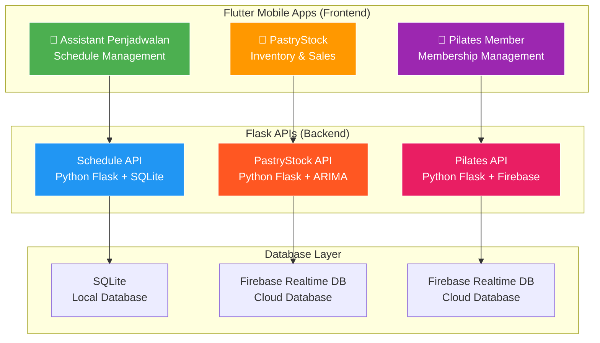

<h1 align="center">🚀 Flutter Multi-App Development Suite</h1>
<h2 align="center">Ficram Manifur Farissa</h2>

<p align="center">
  
  
  
  
  
</p>

<p align="center">
  <strong>🔧 3 Complete Applications: Scheduling Assistant, PastryStock & Pilates Member</strong><br>
  Built with <strong>Flutter</strong> (Frontend) and <strong>Python Flask</strong> (Backend)
</p>

<p align="center">
  <a href="#-applications-overview">Applications</a> •
  <a href="#-quick-start">Quick Start</a> •
  <a href="#-project-structure">Structure</a> •
  <a href="#-development-setup">Setup</a> •
  <a href="#-deployment">Deployment</a>
</p>

---

## 📊 Repository Architecture



### 🛠 Development Setup
## 1️⃣ Menggunakan Android Emulator
I use Android Emulator for this Flutter project.
Pastikan kamu sudah menginstall Android SDK dan membuat emulator menggunakan AVD Manager atau avdmanager CLI.

Jalankan emulator sebelum flutter run:

```bash
emulator -avd MyEmulatorName
```
Panduan singkat membuat emulator via command line:

```bash
# Install system image Android 13
sdkmanager "system-images;android-33;google_apis;x86_64"

# Buat AVD
avdmanager create avd -n MyEmulator -k "system-images;android-33;google_apis;x86_64" -d pixel

# Jalankan emulator
emulator -avd MyEmulator
```

## 2️⃣ Konfigurasi gradle.properties
Untuk memastikan performa build yang stabil pada emulator, gunakan konfigurasi berikut:
```properties
org.gradle.jvmargs=-Xmx1024m -XX:MaxMetaspaceSize=512m -XX:ReservedCodeCacheSize=256m -XX:+HeapDumpOnOutOfMemoryError
android.useAndroidX=true
android.enableJetifier=true
```
Letakkan file gradle.properties ini di:
```bash
<project-root>/android/gradle.properties
```
