<h1 align="center">🚀 Flutter Multi-App Development Suite</h1>
<h2 align="center">Ficram Manifur Farissa</h2>

  
  
  
  
  

  <strong>🔧 3 Complete Applications: Scheduling Assistant, PastryStock & Pilates Member</strong> 
  Built with <strong>Flutter</strong> (Frontend) and <strong>Python Flask</strong> (Backend)

  <a href="#-applications-overview">Applications</a> •
  <a href="#-quick-start">Quick Start</a> •
  <a href="#-project-structure">Structure</a> •
  <a href="#-development-setup">Setup</a> •
  <a href="#-deployment">Deployment</a>

---

## 📊 Repository Architecture

```mermaid
graph TB
    subgraph "Flutter Mobile Apps (Frontend)"
        A1[📅 Assistant Penjadwalan<br/>Schedule Management]
        A2[🧁 PastryStock<br/>Inventory & Sales]
        A3[🧘 Pilates Member<br/>Membership Management]
    end
    
    subgraph "Flask APIs (Backend)"
        B1[Schedule API<br/>Python Flask + SQLite]
        B2[PastryStock API<br/>Python Flask + ARIMA]
        B3[Pilates API<br/>Python Flask + Firebase]
    end
    
    subgraph "Database Layer"
        C1[SQLite<br/>Local Database]
        C2[Firebase Realtime DB<br/>Cloud Database]
        C3[Firebase Realtime DB<br/>Cloud Database]
    end
    
    A1 --> B1
    A2 --> B2
    A3 --> B3
    
    B1 --> C1
    B2 --> C2
    B3 --> C3
    
    style A1 fill:#4CAF50,stroke:#fff,color:#fff
    style A2 fill:#FF9800,stroke:#fff,color:#fff
    style A3 fill:#9C27B0,stroke:#fff,color:#fff
    style B1 fill:#2196F3,stroke:#fff,color:#fff
    style B2 fill:#FF5722,stroke:#fff,color:#fff
    style B3 fill:#E91E63,stroke:#fff,color:#fff
```

# Flutter Multi-App Development Setup - Quick Start

This guide walks you through setting up the Flutter development environment from absolute zero to running all three applications on an Android Emulator.

## System Requirements

- **macOS 10.14+**, **Windows 10+**, or **Linux (Ubuntu 18.04+)**
- **4GB RAM minimum** (8GB+ recommended)
- **5GB free disk space** for Flutter SDK and emulator
- **Internet connection** for downloading dependencies

## What You'll Be Setting Up

This Flutter project contains **3 complete applications**:
1. **Scheduling Assistant** (📅) - Schedule management app
2. **PastryStock** (🧁) - Inventory and sales tracking  
3. **Pilates Member** (🧘) - Membership management

All apps use:
- **Flutter** for mobile frontend
- **Python Flask** for backend APIs
- **Local/Firebase databases** for data persistence

## Which Guide to Follow?

- **macOS**: See `01-macos-setup.md`
- **Windows**: See `02-windows-setup.md`
- **Linux**: See `03-linux-setup.md`

---

**Estimated Total Time**: 30-45 minutes (including downloads)

**Need Help?** Jump to `99-troubleshooting.md` if you encounter issues.
